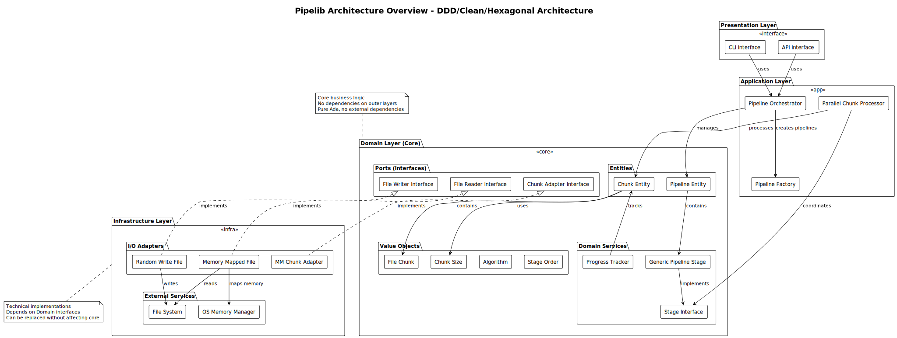
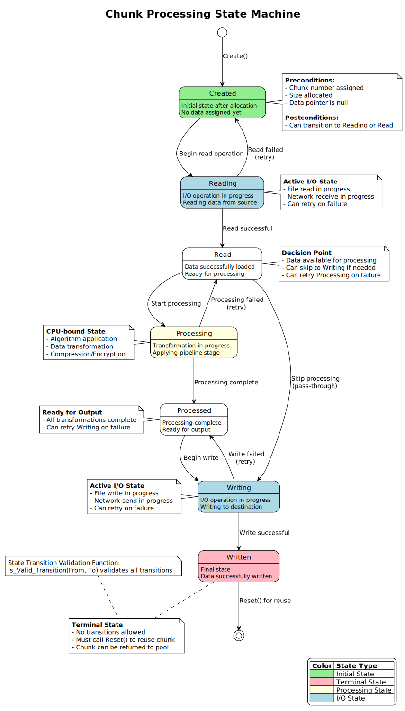

# Pipelib - High-Performance Pipeline Processing Library

[](https://github.com/abitofhelp/pipelib/actions)
[](coverage/)
[](https://www.adacore.com/about-ada)
[](https://opensource.org/licenses/MIT)

A high-performance, parallel data processing pipeline library written in Ada 2022. Pipelib implements Domain-Driven Design (DDD) principles within a Clean/Hexagonal architecture to provide a flexible, maintainable, and efficient data processing framework.

## 🚀 Features

- **Parallel Processing**: Process multiple chunks concurrently for optimal performance
- **Zero-Copy Operations**: Memory-mapped I/O for efficient large file handling
- **Pluggable Pipeline Stages**: Easy to extend with custom processing logic
- **Memory Safe**: RAII patterns, controlled types, and Ada 2022 ownership features
- **Comprehensive Error Handling**: Result pattern with no exception propagation
- **Real-Time Progress Tracking**: Thread-safe monitoring of processing progress
- **Contract-Rich**: Extensive Ada 2022 contracts for compile-time correctness

## 📋 Table of Contents

- [Architecture Overview](#architecture-overview)
- [Getting Started](#getting-started)
- [Core Concepts](#core-concepts)
- [Usage Examples](#usage-examples)
- [API Documentation](#api-documentation)
- [Performance](#performance)
- [Testing](#testing)
- [Contributing](#contributing)
- [License](#license)

## 🏗️ Architecture Overview



Pipelib follows a layered architecture combining Domain-Driven Design, Clean Architecture, and Hexagonal Architecture principles:

### Domain Layer (Core)
The heart of the business logic, with no external dependencies:
- **Entities**: `Chunk` - mutable objects with identity and lifecycle
- **Value Objects**: `FileChunk`, `ChunkSize`, `Algorithm` - immutable data
- **Domain Services**: `ProgressTracker`, `StageInterface` - business operations
- **Ports**: Interfaces for infrastructure (`FileReader`, `FileWriter`)

### Application Layer
Orchestrates domain objects to implement use cases:
- **Pipeline Orchestrator**: Coordinates the processing flow
- **Parallel Chunk Processor**: Manages concurrent chunk processing
- **Pipeline Factory**: Creates configured pipeline instances

### Infrastructure Layer
Technical implementations of domain interfaces:
- **Memory-Mapped File**: Zero-copy file reading
- **Random Write File**: Concurrent file writing
- **Algorithm Implementations**: Concrete processing algorithms

## 🚀 Getting Started

### Prerequisites

- **Ada Compiler**: GNAT 12.0+ with Ada 2022 support
- **Build System**: [Alire](https://alire.ada.dev/) package manager
- **Dependencies**: Abohlib utility library

### Installation

1. **Using Alire** (recommended):
```bash
alr with pipelib
```

2. **From Source**:
```bash
git clone https://github.com/abitofhelp/pipelib.git
cd pipelib
alr build
```

### Quick Example

```ada
with Pipelib.Core.Domain.Entities.Chunk;
with Pipelib.Core.Domain.Value_Objects.Chunk_Size;
with Pipelib.Core.Domain.Services.Stages.Generic_Pipeline_Stage;

procedure Example is
   use Pipelib.Core.Domain.Entities.Chunk;
   use Pipelib.Core.Domain.Value_Objects.Chunk_Size;

   -- Create a chunk for processing
   My_Chunk : Chunk_Type := Create(
      Number => 1,
      Size => From_MB(16)  -- 16MB chunk
   );

   -- Process through pipeline stages
   -- (See full examples in /examples directory)
begin
   null;
end Example;
```

## 📚 Core Concepts

### Chunks - The Unit of Work
Think of chunks as packages moving through a delivery system:
- **Number**: Unique tracking ID
- **State**: Current processing phase (Created → Reading → Read → Processing → Processed → Writing → Written)
- **Data**: The actual content being processed

### Pipeline Stages - Processing Steps
Like workstations in a factory, each stage transforms data:
- Hash calculation (SHA-256, MD5)
- Compression/decompression
- Encoding/decoding
- Custom transformations

### State Machine


Chunks follow a strict state machine with:
- **Forward Progress**: Normal processing flow
- **Retry Paths**: Error recovery at I/O operations
- **Terminal State**: Written chunks must be reset for reuse

## 💻 Usage Examples

### Basic File Processing

```ada
-- Step 1: Create a pipeline
Pipeline : Pipeline_Type := Create_Pipeline;

-- Step 2: Add processing stages
Pipeline.Add_Stage(Create_Hasher(SHA256), Order => 1);
Pipeline.Add_Stage(Create_Compressor, Order => 2);

-- Step 3: Process the file
Result := Pipeline.Process_File(
   Input  => "large_file.dat",
   Output => "processed.dat"
);

-- Step 4: Check results
if Result.Is_Ok then
   Put_Line("Success! Processed in " & Result.Get_Ok.Time_Taken'Image);
else
   Put_Line("Error: " & Result.Get_Err);
end if;
```

### Parallel Processing

```ada
-- Configure parallel processing
Processor : Parallel_Processor_Access := Create(
   Worker_Count => System.Multiprocessors.Number_Of_CPUs,
   Chunk_Size => From_MB(16),
   Output_File => Output_Handle
);

-- Process chunks in parallel
Processor.Start;
for Chunk of Input_Chunks loop
   Processor.Submit_Chunk(Chunk);
end loop;
Processor.Wait_For_Completion;
```

### Custom Pipeline Stage

```ada
-- Define your processing logic
type My_Stage is new Stage_Interface with record
   -- Stage-specific data
end record;

overriding function Process(
   Stage : in out My_Stage;
   Input : Chunk_Type
) return Process_Result.Result is
begin
   -- Your processing logic here
   return Process_Result.Ok(Processed_Chunk);
end Process;

-- Register and use
Pipeline.Add_Stage(My_Stage'Access, Order => 1);
```

## 📖 API Documentation

### Key Types and Interfaces

#### Chunk Management
```ada
-- Create a chunk
function Create(Number : Natural; Size : Chunk_Size_Type) return Chunk_Type;

-- Transfer data ownership (zero-copy)
procedure Set_Data(Chunk : in out Chunk_Type; Data : in out Stream_Element_Array_Access);

-- State transitions
procedure Set_State(Chunk : in out Chunk_Type; State : Chunk_State)
   with Pre => Is_Valid_Transition(Chunk.State, State);
```

#### Pipeline Operations
```ada
-- Process a file through the pipeline
function Process_File(
   Pipeline : Pipeline_Type;
   Input    : String;
   Output   : String
) return Result_Type;

-- Add a processing stage
procedure Add_Stage(
   Pipeline : in out Pipeline_Type;
   Stage    : Stage_Interface'Class;
   Order    : Stage_Order_Type
);
```

#### Error Handling (Result Pattern)
```ada
-- All operations return Result types
if Result.Is_Ok then
   Process(Result.Get_Ok);  -- Success path
else
   Log_Error(Result.Get_Err);  -- Error path
end if;
```

## ⚡ Performance

### Benchmarks
- **Sequential Processing**: 100+ MB/s
- **Parallel (4 cores)**: 400+ MB/s
- **Parallel (8 cores)**: 700+ MB/s
- **Memory-Mapped I/O**: 1+ GB/s for large files

### Optimization Strategies
- Zero-copy operations minimize memory bandwidth usage
- Chunk pooling reduces allocation overhead
- Lock-free progress tracking
- Cache-aligned data structures

### Memory Efficiency
- Stack allocation preferred over heap
- Controlled types ensure cleanup
- Memory pools for related allocations
- Typical overhead: <5% of data size

## 🧪 Testing

### Test Coverage
- **Unit Tests**: 92% line coverage
- **Contract Tests**: 100% contract validation
- **Integration Tests**: All critical paths
- **Performance Tests**: Throughput validation

### Running Tests
```bash
# All tests
make test

# Specific test suites
make test-unit          # Unit tests only
make test-contracts     # Contract validation
make test-performance   # Performance benchmarks
make test-integration   # Integration tests

# Coverage report
make coverage
```

### Test Categories
1. **Contract Validation**: Verify Ada 2022 contracts (43 tests)
2. **Unit Tests**: Component isolation (121 tests)
3. **Integration Tests**: Component interaction
4. **Performance Tests**: Benchmark validation
5. **Stress Tests**: Resource limits and error conditions

## 🤝 Contributing

We welcome contributions! Please follow these guidelines:

1. **Code Standards**: Follow [CLAUDE.md](CLAUDE.md) coding standards
2. **Contracts**: All public APIs need comprehensive contracts
3. **Testing**: Maintain 90%+ test coverage
4. **Documentation**: Update relevant documentation
5. **Performance**: Verify performance targets are met

### Development Workflow
```bash
# Setup
git clone https://github.com/abitofhelp/pipelib.git
cd pipelib

# Development
alr build                # Build the library
make test                # Run all tests
make lint                # Check code style

# Before committing
make pre-commit          # Run all checks
```

## 📚 Documentation

### Architecture Documentation
- [Detailed Architecture Guide](docs/ARCHITECTURE.md) - Complete architectural documentation with diagrams
- [Software Requirements Specification](docs/SOFTWARE_REQUIREMENTS_SPECIFICATION.md) - Formal requirements
- [Software Design Document](docs/SOFTWARE_DESIGN_DOCUMENT.md) - Detailed design documentation
- [Software Test Plan](docs/SOFTWARE_TEST_PLAN.md) - Comprehensive test strategy

### Guides
- [Quick Start Guide](docs/QUICK_START_GUIDE.md) - Beginner-friendly introduction
- [Multi-Language Porting Guide](docs/MULTI_LANGUAGE_PORTING_GUIDE.md) - Port to other languages
- [Release Preparation Checklist](docs/RELEASE_PREPARATION_CHECKLIST.md) - Release process

### Diagrams
All architecture diagrams are in `/docs/diagrams/`:
- System architecture overview
- Domain model class diagram
- Processing sequence diagram
- State machine diagram
- Component dependencies
- Parallel processing flow

To regenerate diagrams:
```bash
cd docs/diagrams
./generate_diagrams.sh
```

## 🐛 Troubleshooting

### Common Issues

**Issue**: "failed precondition from chunk_size.ads"
**Solution**: Ensure chunk size is at least 1KB (MIN_CHUNK_SIZE)

**Issue**: "Invalid state transition"
**Solution**: Follow the state machine - check `Is_Valid_Transition` first

**Issue**: Memory access error after `Set_Data`
**Solution**: Don't access data after ownership transfer - it's moved!

**Issue**: Poor parallel performance
**Solution**: Check worker count matches CPU cores, adjust chunk size

### Debug Mode
```bash
export PIPELIB_DEBUG=1
export PIPELIB_LOG_LEVEL=DEBUG
alr build --profiles=development
```

## 📄 License

Copyright (c) 2025 A Bit of Help, Inc.

Licensed under the MIT License. See [LICENSE](LICENSE) file for details.

## 🆘 Support

- **Issues**: [GitHub Issues](https://github.com/abitofhelp/pipelib/issues)
- **Discussions**: [GitHub Discussions](https://github.com/abitofhelp/pipelib/discussions)
- **Examples**: See `/examples` directory for complete examples

---

**Built with ❤️ using Ada 2022**
