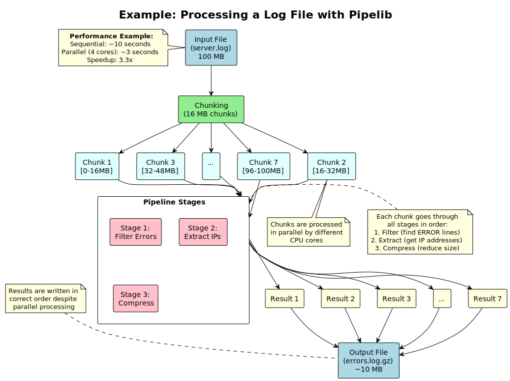

# Pipelib Quick Start Guide for Junior Developers

## What is Pipelib?

Pipelib is a library for processing large files in parallel. Think of it as a factory assembly line where:
- Files are broken into **chunks** (like parts on an assembly line)
- Each chunk goes through **stages** (like workstations)
- Multiple chunks are processed **in parallel** (multiple assembly lines)
- **Progress is tracked** throughout the process

## Core Concepts Explained

### 1. Chunks 🧩
A chunk is a piece of data being processed:
```ada
-- Create a chunk (like getting a part ready for the assembly line)
My_Chunk : Chunk_Type := Create(Number => 1, Size => From_MB(16));
```

**Think of it as**: A package moving through a delivery system. It has:
- A tracking number (`Number`)
- Current location/status (`State`)
- Contents (`Data`)

### 2. Pipeline Stages 🏭
Stages transform data (like workstations in a factory):
```ada
-- A stage that compresses data
Compression_Stage : Stage_Interface'Class := Create_Compressor();

-- A stage that calculates checksums
Hash_Stage : Stage_Interface'Class := Create_Hasher(SHA256());
```

**Think of it as**: Instagram filters. Each stage applies a transformation to your data.

### 3. State Machine 🚦
Chunks move through states like a traffic light system:
```
Created (🟡) → Reading (🔵) → Read (🟢) → Processing (🟡) →
Processed (🟢) → Writing (🔵) → Written (🔴)
```
- 🟡 Yellow = Waiting/Ready
- 🔵 Blue = I/O Operation (Reading/Writing)
- 🟢 Green = Ready for next step
- 🔴 Red = Complete (terminal state)

### 4. Value Objects vs Entities 📦
**Value Objects** (like FileChunk):
- Immutable (can't change)
- No unique ID
- Like a photograph - you don't change it, you take a new one

**Entities** (like Chunk):
- Mutable (can change state)
- Have unique ID
- Like a student - same person, but changes grades/status

## Architecture Layers 🎂

Think of the architecture as a cake with layers:

### 1. Domain Layer (Center) 🎯
The heart of the business logic:
- What is a chunk?
- How do chunks change state?
- What are the rules?

**Example**: "A chunk can only move from 'Read' to 'Processing', never backwards"

### 2. Application Layer (Middle) 🔧
Orchestrates the domain:
- How to process a file
- How to coordinate stages
- How to track progress

**Example**: "To process a file: open it, create chunks, run them through stages, save results"

### 3. Infrastructure Layer (Outer) 🏗️
Technical implementations:
- How to read files (memory mapping)
- How to write files (random access)
- How to calculate hashes (SHA-256 library)

**Example**: "Use memory-mapped files for fast reading of large files"

## Common Patterns Used

### 1. Result Pattern (Error Handling) ✅❌
Instead of exceptions, we use Results:
```ada
-- Instead of this (exceptions):
begin
   Process_Chunk(C);  -- Might raise exception
exception
   when E: others => Handle_Error(E);
end;

-- We do this (Result pattern):
Result := Process_Chunk(C);
if Result.Is_Ok then
   -- Success! Use Result.Get_Ok
else
   -- Error! Use Result.Get_Err
end if;
```

**Why?** It forces you to handle errors and makes them visible in the code.

### 2. Factory Pattern 🏭
Creates objects with proper setup:
```ada
-- Instead of complex manual creation:
Stage := new Hash_Stage_Type;
Stage.Algorithm := SHA256;
Stage.Initialize;

-- Use a factory:
Stage := Create_Hash_Stage(SHA256());
```

**Why?** Ensures objects are created correctly every time.

### 3. Interface Pattern 🔌
Define what something does, not how:
```ada
-- Any type implementing Stage_Interface can be used
type Stage_Interface is interface;
function Process(S : Stage_Interface; Input : Chunk_Type) return Result;
```

**Why?** You can swap implementations without changing code that uses them.

## Step-by-Step: Processing a File



```ada
-- 1. Create a pipeline
Pipeline : Pipeline_Type := Create_Pipeline;

-- 2. Add stages (like adding filters to a photo)
Pipeline.Add_Stage(Create_Hasher(SHA256), Order => 1);
Pipeline.Add_Stage(Create_Compressor, Order => 2);

-- 3. Process the file
Result := Pipeline.Process_File(
   Input  => "big_file.dat",
   Output => "processed.dat"
);

-- 4. Check the result
if Result.Is_Ok then
   Put_Line("Success! Processed in " & Result.Get_Ok.Time_Taken'Image);
else
   Put_Line("Error: " & Result.Get_Err);
end if;
```

## Debugging Tips 🐛

### 1. Check State Transitions
If chunks aren't processing:
```ada
Put_Line("Chunk " & Chunk.Number'Image & " state: " & Chunk.State'Image);
```

### 2. Monitor Progress
```ada
Progress : Progress_Info := Tracker.Get_Progress;
Put_Line("Read: " & Progress.Read_Percentage'Image & "%");
Put_Line("Processed: " & Progress.Process_Percentage'Image & "%");
```

### 3. Validate Results
Always check Result types:
```ada
if not Result.Is_Ok then
   Log_Error("Failed at chunk " & Chunk.Number'Image & ": " & Result.Get_Err);
end if;
```

## Best Practices 📋

### DO ✅
1. **Check all Results** - Never ignore return values
2. **Use appropriate chunk sizes** - 16MB is a good default
3. **Log state transitions** - Helps debugging
4. **Reuse chunks** - Call Reset() instead of creating new ones
5. **Read the contracts** - Pre/Post conditions tell you the rules

### DON'T ❌
1. **Don't access chunk data after transfer** - Ownership is moved
2. **Don't skip state transitions** - Follow the state machine
3. **Don't ignore error results** - Handle them explicitly
4. **Don't create chunks smaller than 1KB** - MIN_CHUNK_SIZE limit
5. **Don't modify infrastructure** - Change domain instead

## Common Issues and Solutions

### Issue: "failed precondition from chunk_size.ads"
**Cause**: Trying to create a chunk smaller than MIN_CHUNK_SIZE (1KB)
**Solution**: Use at least 1KB for chunk size

### Issue: "Invalid state transition"
**Cause**: Trying to move to an invalid state (e.g., Written → Reading)
**Solution**: Check Is_Valid_Transition first or follow the state diagram

### Issue: "Memory access error"
**Cause**: Accessing data after ownership transfer
**Solution**: Don't use data pointers after Set_Data

### Issue: "Progress stuck at 0%"
**Cause**: Forgot to update progress tracker
**Solution**: Call Update_*_Count methods after each operation

## Getting Help 🆘

1. **Read the contracts** - Pre/Post conditions document the rules
2. **Check the tests** - Examples of correct usage
3. **Use the architecture diagrams** - Visual understanding helps
4. **Follow the patterns** - Consistency makes code predictable
5. **Ask questions** - No question is too simple!

## Next Steps 🚀

1. Run the example programs in `/examples`
2. Read the test files to see usage patterns
3. Try modifying a simple stage (like Uppercase)
4. Build your own pipeline configuration
5. Experiment with different chunk sizes

Remember: Pipelib is like building with LEGO blocks. Each piece has a specific purpose, and they fit together in predictable ways. Start simple and build up!
